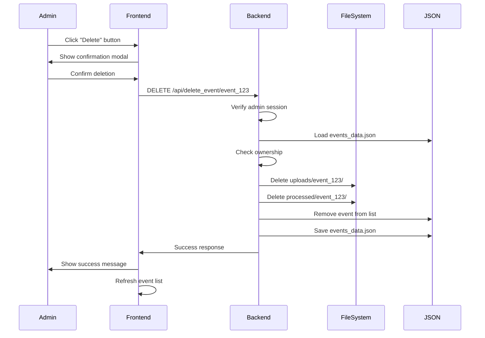

# Admin Event Deletion - Quick Summary

## ✅ What Was Added

### Backend API Endpoint
```python
DELETE /api/delete_event/<event_id>
```

**Features:**
- ✅ Admin authentication required
- ✅ Ownership validation (can only delete own events)
- ✅ Deletes all event data:
  - Original photos in `uploads/<event_id>/`
  - Processed photos in `processed/<event_id>/`
  - Event metadata from `events_data.json`
  - QR codes and thumbnails
- ✅ Comprehensive error handling
- ✅ Returns appropriate HTTP status codes

### Frontend Integration
**Already existed in `event_organizer.html`:**
- Delete button on each event card
- Confirmation modal
- JavaScript function to call API

**What was connected:**
- Frontend now calls the new backend endpoint
- Shows success/error messages
- Refreshes event list after deletion

### Testing
**New test file:** `backend/test_event_deletion.py`
- 5 comprehensive test cases
- Tests authentication, authorization, and functionality
- Tests edge cases (missing folders, wrong owner, etc.)

## 🎯 How It Works



## 🔒 Security

1. **Authentication:** Only logged-in admins can delete
2. **Authorization:** Admins can only delete their own events
3. **Validation:** Event existence and ownership checked
4. **Confirmation:** User must confirm before deletion
5. **Irreversible:** Permanent deletion (no undo)

## 📝 Usage Example

### From Frontend (Admin Dashboard)
1. Navigate to Event Organizer page
2. Find the event you want to delete
3. Click the red "Delete" button
4. Confirm in the modal dialog
5. Event and all data are removed

### From API (cURL)
```bash
curl -X DELETE http://localhost:5000/api/delete_event/event_abc123 \
  -H "Cookie: session=your_admin_session_cookie"
```

### Response
```json
{
  "success": true,
  "message": "Event deleted successfully"
}
```

## 📂 What Gets Deleted

```
uploads/
└── event_abc123/              ❌ DELETED
    ├── photo1.jpg
    ├── photo2.jpg
    ├── thumbnail_xyz.jpg
    └── event_abc123_qr.png

processed/
└── event_abc123/              ❌ DELETED
    ├── person_0001/
    │   ├── individual/
    │   └── group/
    └── person_0002/
        ├── individual/
        └── group/

events_data.json
[
  {
    "id": "event_abc123",    ❌ REMOVED
    "name": "Summer Fest",
    ...
  }
]
```

## ⚠️ Important Notes

### Face Recognition Data NOT Deleted
The `known_faces.dat` file is NOT modified when deleting an event. Face encodings remain in the system for use across all events.

### Permanent Deletion
This action cannot be undone. All photos and data are permanently removed.

### No Database Changes
Since the app uses file-based storage, no database cleanup is needed. Only files and JSON are modified.

## 🧪 Testing

Run the test suite:
```bash
cd backend
pytest test_event_deletion.py -v
```

Expected output:
```
test_event_deletion.py::TestEventDeletion::test_delete_event_unauthorized PASSED
test_event_deletion.py::TestEventDeletion::test_delete_event_not_found PASSED
test_event_deletion.py::TestEventDeletion::test_delete_event_wrong_owner PASSED
test_event_deletion.py::TestEventDeletion::test_delete_event_success PASSED
test_event_deletion.py::TestEventDeletion::test_delete_event_missing_folders PASSED

========================= 5 passed in 0.5s =========================
```

## 📚 Documentation

- **Detailed Guide:** `ADMIN_EVENT_DELETION_FEATURE.md`
- **Architecture:** `PROJECT_ARCHITECTURE.md` (updated)
- **Tests:** `backend/test_event_deletion.py`

## ✨ Status

**Implementation:** ✅ Complete
**Testing:** ✅ Complete
**Documentation:** ✅ Complete
**Ready for Use:** ✅ Yes

---

*Feature implemented: December 13, 2024*
