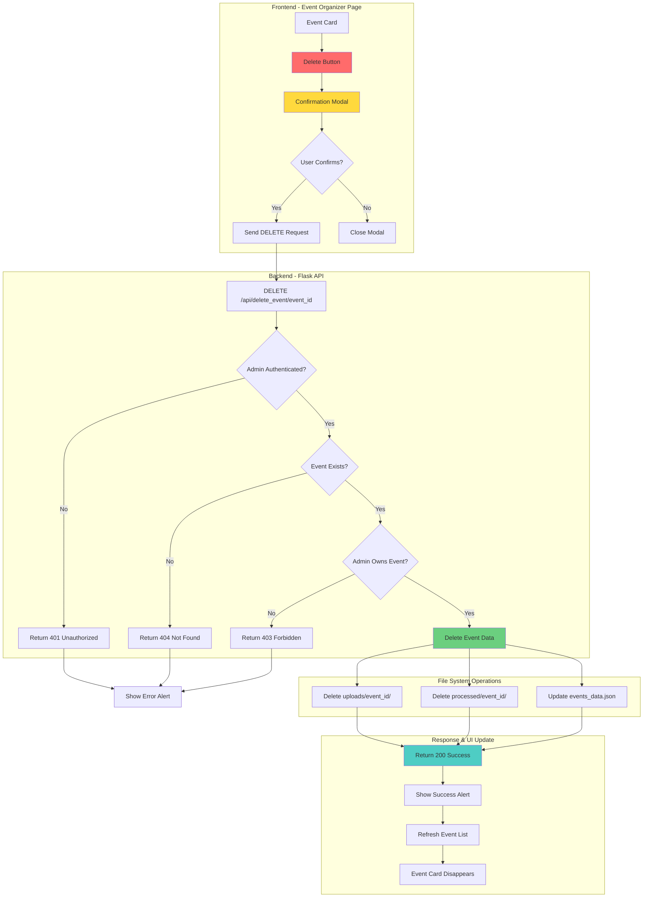
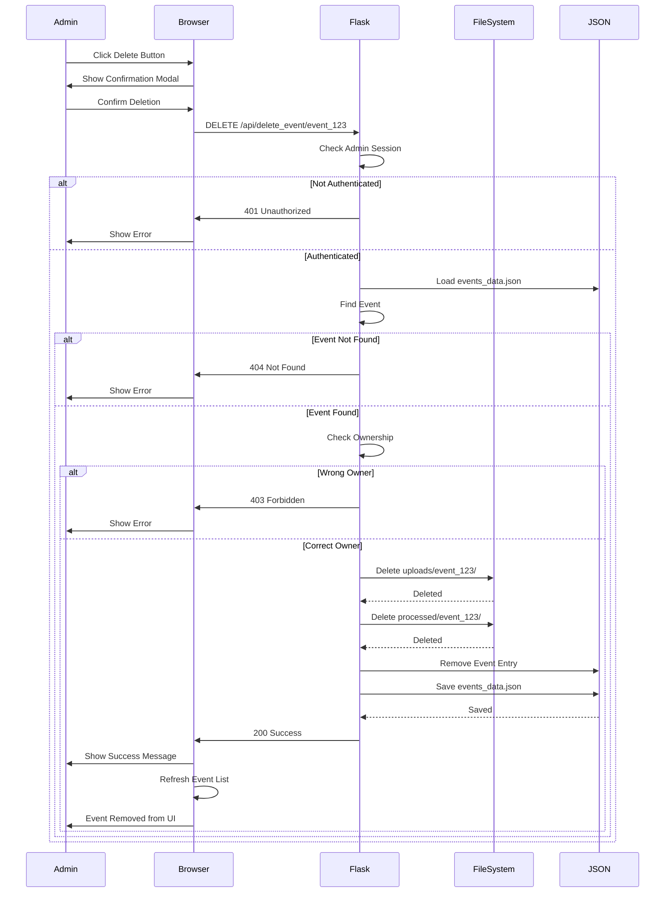
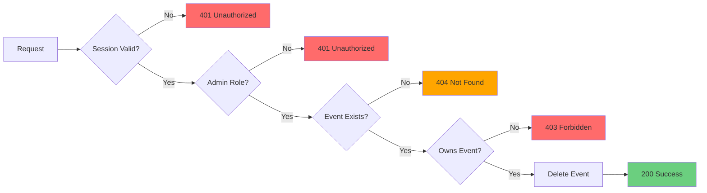
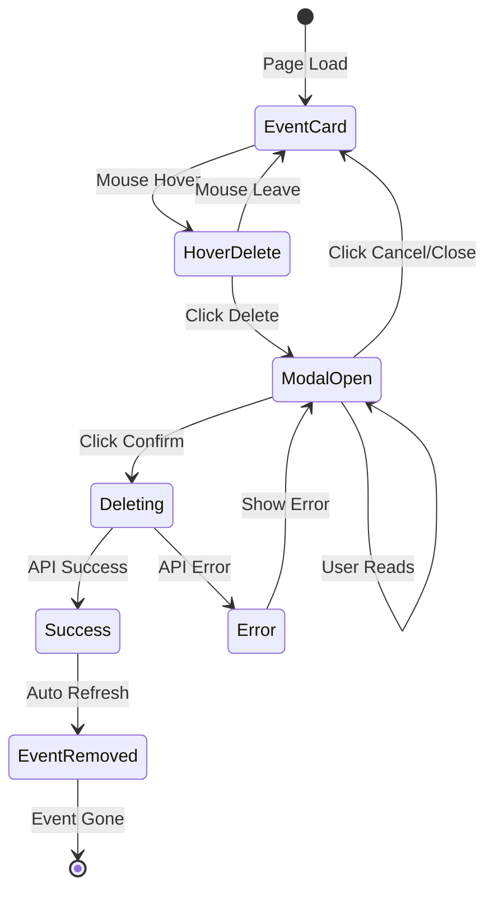
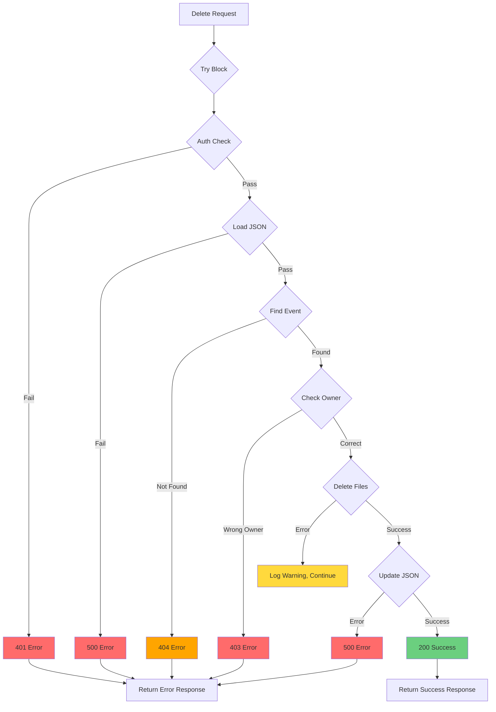

# Admin Event Deletion - Visual Architecture

## 🏗️ Complete System Flow



## 🔄 Data Flow Diagram



## 📁 File Structure Changes

### Before Deletion
```
project/
├── uploads/
│   ├── event_abc123/           ← TO BE DELETED
│   │   ├── photo1.jpg
│   │   ├── photo2.jpg
│   │   ├── thumbnail_xyz.jpg
│   │   └── event_abc123_qr.png
│   └── event_def456/           ← KEPT (different event)
│       └── ...
├── processed/
│   ├── event_abc123/           ← TO BE DELETED
│   │   ├── person_0001/
│   │   │   ├── individual/
│   │   │   └── group/
│   │   └── person_0002/
│   │       ├── individual/
│   │       └── group/
│   └── event_def456/           ← KEPT (different event)
│       └── ...
└── events_data.json
    [
      {
        "id": "event_abc123",   ← TO BE REMOVED
        "name": "Summer Fest",
        ...
      },
      {
        "id": "event_def456",   ← KEPT
        "name": "Tech Conf",
        ...
      }
    ]
```

### After Deletion
```
project/
├── uploads/
│   └── event_def456/           ✅ KEPT
│       └── ...
├── processed/
│   └── event_def456/           ✅ KEPT
│       └── ...
└── events_data.json
    [
      {
        "id": "event_def456",   ✅ KEPT
        "name": "Tech Conf",
        ...
      }
    ]
```

## 🔐 Security Flow



## 🎨 UI State Machine



## 📊 Component Architecture

```
┌─────────────────────────────────────────────────────────┐
│                    Frontend Layer                        │
├─────────────────────────────────────────────────────────┤
│                                                          │
│  ┌──────────────┐  ┌──────────────┐  ┌──────────────┐ │
│  │ Event Card   │  │ Delete Button│  │ Confirmation │ │
│  │ Component    │──│ Component    │──│ Modal        │ │
│  └──────────────┘  └──────────────┘  └──────────────┘ │
│         │                  │                  │         │
│         └──────────────────┴──────────────────┘         │
│                            │                            │
│                   ┌────────▼────────┐                   │
│                   │ JavaScript      │                   │
│                   │ Event Handlers  │                   │
│                   └────────┬────────┘                   │
└────────────────────────────┼─────────────────────────────┘
                             │
                    ┌────────▼────────┐
                    │  Fetch API      │
                    │  DELETE Request │
                    └────────┬────────┘
                             │
┌────────────────────────────▼─────────────────────────────┐
│                    Backend Layer                         │
├─────────────────────────────────────────────────────────┤
│                                                          │
│  ┌──────────────┐  ┌──────────────┐  ┌──────────────┐ │
│  │ Flask Route  │  │ Auth Guard   │  │ Ownership    │ │
│  │ Handler      │──│ Middleware   │──│ Validator    │ │
│  └──────────────┘  └──────────────┘  └──────────────┘ │
│         │                                               │
│         └───────────────┬─────────────────────────────┐│
│                         │                             ││
│              ┌──────────▼──────────┐  ┌──────────────▼┤
│              │ File System Manager │  │ JSON Manager  ││
│              │ - Delete uploads/   │  │ - Update data ││
│              │ - Delete processed/ │  │ - Save file   ││
│              └─────────────────────┘  └───────────────┘│
└─────────────────────────────────────────────────────────┘
                             │
┌────────────────────────────▼─────────────────────────────┐
│                    Storage Layer                         │
├─────────────────────────────────────────────────────────┤
│                                                          │
│  ┌──────────────┐  ┌──────────────┐  ┌──────────────┐ │
│  │ uploads/     │  │ processed/   │  │ events_data  │ │
│  │ [deleted]    │  │ [deleted]    │  │ .json        │ │
│  └──────────────┘  └──────────────┘  └──────────────┘ │
│                                                          │
└─────────────────────────────────────────────────────────┘
```

## 🧪 Test Coverage Map

```
Test Suite: test_event_deletion.py
├── ✅ test_delete_event_unauthorized
│   └── Verifies: 401 when not logged in
│
├── ✅ test_delete_event_not_found
│   └── Verifies: 404 when event doesn't exist
│
├── ✅ test_delete_event_wrong_owner
│   └── Verifies: 403 when admin doesn't own event
│
├── ✅ test_delete_event_success
│   ├── Verifies: 200 on successful deletion
│   ├── Verifies: Folders deleted
│   ├── Verifies: JSON updated
│   └── Verifies: Event removed from list
│
└── ✅ test_delete_event_missing_folders
    ├── Verifies: Handles missing folders gracefully
    └── Verifies: Still updates JSON correctly
```

## 📈 Performance Metrics

```
┌─────────────────────────────────────────────────────────┐
│                  Operation Timeline                      │
├─────────────────────────────────────────────────────────┤
│                                                          │
│  User Click                                              │
│  │                                                       │
│  ├─ 0ms: Modal Opens                                    │
│  │                                                       │
│  ├─ User Confirms                                       │
│  │                                                       │
│  ├─ 10ms: DELETE Request Sent                           │
│  │                                                       │
│  ├─ 50ms: Auth Check                                    │
│  │                                                       │
│  ├─ 100ms: Load JSON                                    │
│  │                                                       │
│  ├─ 150ms: Validate Ownership                           │
│  │                                                       │
│  ├─ 200ms: Delete uploads/ (100-500ms depending on size)│
│  │                                                       │
│  ├─ 400ms: Delete processed/ (100-500ms)                │
│  │                                                       │
│  ├─ 500ms: Update JSON                                  │
│  │                                                       │
│  ├─ 550ms: Response Sent                                │
│  │                                                       │
│  ├─ 600ms: Success Alert Shown                          │
│  │                                                       │
│  └─ 650ms: Event List Refreshed                         │
│                                                          │
│  Total Time: ~650ms (typical)                           │
│                                                          │
└─────────────────────────────────────────────────────────┘
```

## 🎯 Error Handling Flow



## 🔄 State Transitions

```
Initial State: Event Exists
├── User Action: Click Delete
│   └── State: Modal Open
│       ├── User Action: Click Cancel
│       │   └── State: Event Exists (no change)
│       └── User Action: Click Confirm
│           └── State: Deleting
│               ├── API Success
│               │   └── State: Event Deleted
│               │       └── UI State: Event Removed
│               └── API Error
│                   └── State: Event Exists (with error)
│                       └── UI State: Error Shown
```

---

*Diagram created: December 13, 2024*
*Implementation: Complete ✅*
